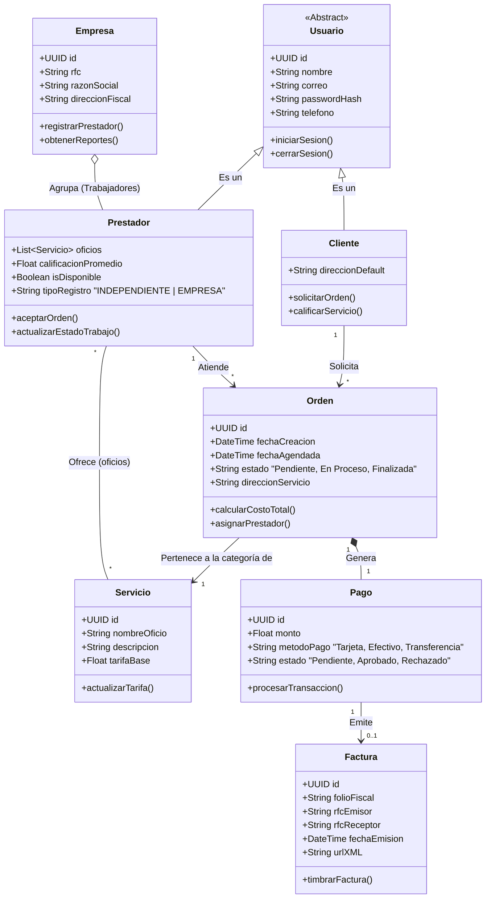
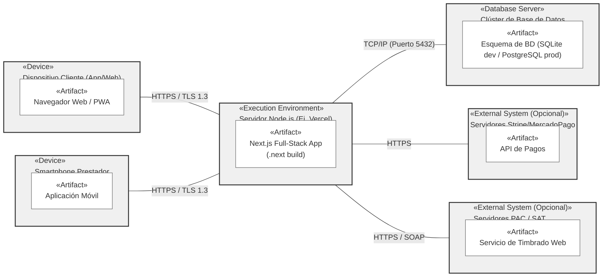

# ServiPro — Diagramas

Este documento contiene:
- Un diagrama de clases (conceptual) basado en el modelo del proyecto.
- La arquitectura de despliegue.

Si quieres el diagrama generado directamente desde Prisma, ver [docs/diagrama-prisma.md](diagrama-prisma.md).

# Diagrama de clases UML 

# Arquitectura de despliegue 

Diagrama (Mermaid):

