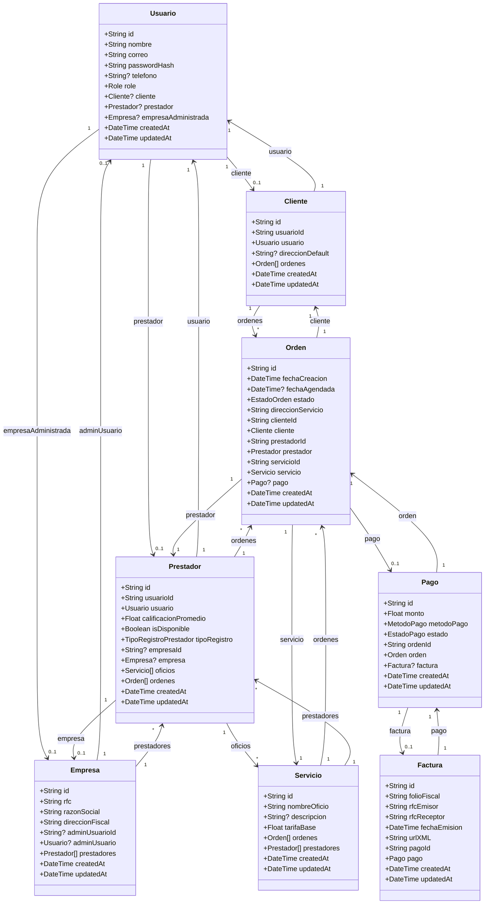

# Diagrama generado desde Prisma

Fuente: prisma/schema.prisma

```mermaid
classDiagram
direction TB
class Usuario {
  +String id
  +String nombre
  +String correo
  +String passwordHash
  +String? telefono
  +Role role
  +Cliente? cliente
  +Prestador? prestador
  +Empresa? empresaAdministrada
  +DateTime createdAt
  +DateTime updatedAt
}

class Cliente {
  +String id
  +String usuarioId
  +Usuario usuario
  +String? direccionDefault
  +Orden[] ordenes
  +DateTime createdAt
  +DateTime updatedAt
}

class Empresa {
  +String id
  +String rfc
  +String razonSocial
  +String direccionFiscal
  +String? adminUsuarioId
  +Usuario? adminUsuario
  +Prestador[] prestadores
  +DateTime createdAt
  +DateTime updatedAt
}

class Prestador {
  +String id
  +String usuarioId
  +Usuario usuario
  +Float calificacionPromedio
  +Boolean isDisponible
  +TipoRegistroPrestador tipoRegistro
  +String? empresaId
  +Empresa? empresa
  +Servicio[] oficios
  +Orden[] ordenes
  +DateTime createdAt
  +DateTime updatedAt
}

class Servicio {
  +String id
  +String nombreOficio
  +String? descripcion
  +Float tarifaBase
  +Orden[] ordenes
  +Prestador[] prestadores
  +DateTime createdAt
  +DateTime updatedAt
}

class Orden {
  +String id
  +DateTime fechaCreacion
  +DateTime? fechaAgendada
  +EstadoOrden estado
  +String direccionServicio
  +String clienteId
  +Cliente cliente
  +String prestadorId
  +Prestador prestador
  +String servicioId
  +Servicio servicio
  +Pago? pago
  +DateTime createdAt
  +DateTime updatedAt
}

class Pago {
  +String id
  +Float monto
  +MetodoPago metodoPago
  +EstadoPago estado
  +String ordenId
  +Orden orden
  +Factura? factura
  +DateTime createdAt
  +DateTime updatedAt
}

class Factura {
  +String id
  +String folioFiscal
  +String rfcEmisor
  +String rfcReceptor
  +DateTime fechaEmision
  +String urlXML
  +String pagoId
  +Pago pago
  +DateTime createdAt
  +DateTime updatedAt
}

Usuario "1" --> "0..1" Cliente : cliente
Usuario "1" --> "0..1" Prestador : prestador
Usuario "1" --> "0..1" Empresa : empresaAdministrada
Cliente "1" --> "1" Usuario : usuario
Cliente "1" --> "*" Orden : ordenes
Empresa "1" --> "0..1" Usuario : adminUsuario
Empresa "1" --> "*" Prestador : prestadores
Prestador "1" --> "1" Usuario : usuario
Prestador "1" --> "0..1" Empresa : empresa
Prestador "1" --> "*" Servicio : oficios
Prestador "1" --> "*" Orden : ordenes
Servicio "1" --> "*" Orden : ordenes
Servicio "1" --> "*" Prestador : prestadores
Orden "1" --> "1" Cliente : cliente
Orden "1" --> "1" Prestador : prestador
Orden "1" --> "1" Servicio : servicio
Orden "1" --> "0..1" Pago : pago
Pago "1" --> "1" Orden : orden
Pago "1" --> "0..1" Factura : factura
Factura "1" --> "1" Pago : pago
```
